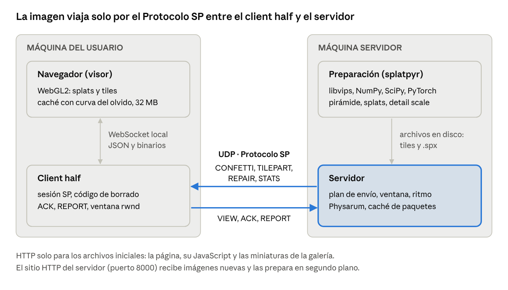
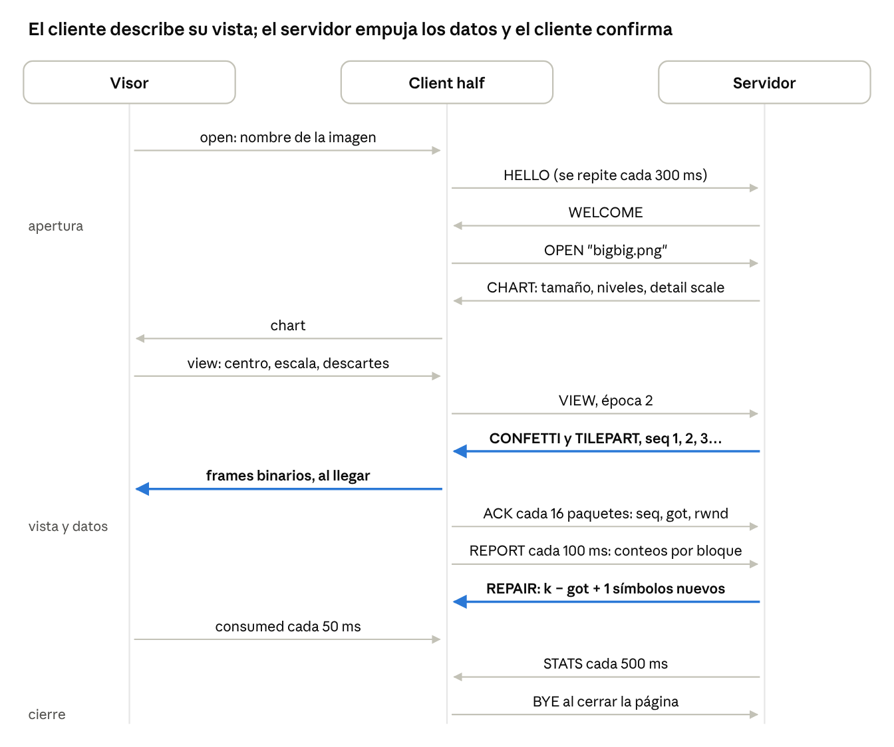
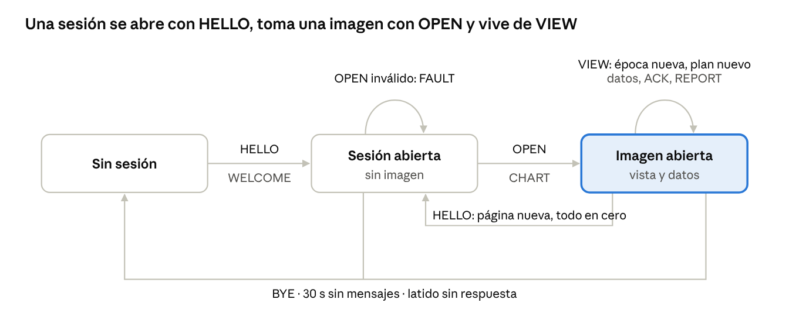

# Protocolo SP — Documento del protocolo de imagen

Rosangela Rodriguez (22000127) · Cruz Ambrocio (20005588) · Ciencias de la Computación VIII · 6 de octubre de 2026

## 1. Resumen

El Protocolo SP transmite imágenes de ultra alta resolución por UDP enviando solo lo que la vista actual necesita, en orden de importancia, con su propio control de errores, de congestión y de flujo. Es un protocolo de capa de aplicación (magic `SP`, versión 2, cabecera fija de 20 bytes, 15 tipos de mensaje) que corre entre el servidor y un *client half* local que entrega los datos al navegador.

Cada imagen se prepara una sola vez como una pirámide de niveles potencia de 2 con *tiles* de 256 px en todos los niveles y, en los niveles gruesos, una representación en *Gaussian splats* que llega primero y tolera pérdidas. El cliente nunca pide archivos: envía dónde está mirando (`VIEW`) y el servidor decide qué enviar, en qué orden y a qué ritmo.

Los mecanismos de control combinan adaptaciones de TCP (RFC 9293) con algoritmos propios:

- **Recuperación**: código de borrado *rateless* sobre GF(256) con retroalimentación solo de conteos, en lugar de Selective Repeat o SACK.
- **Entrega Confetti**: los *blobs* de una unidad se reparten entre sus paquetes, de modo que un paquete perdido produce suavidad, no un hueco.
- **Ventana deslizante y control de flujo**: número de secuencia por paquete, `ACK`, ventana de congestión y ventana de recepción medida en el propio navegador.
- **Control de congestión**: *slow start* con salida estilo HyStart++ y luego *run-and-tumble*, un controlador inspirado en la quimiotaxis bacteriana.
- **Varios usuarios y caché**: modelo *Physarum* (moho mucilaginoso) en el servidor y *curva del olvido* de Ebbinghaus en el navegador.

Las imágenes de evaluación de 17, 24, 28, 55 y 93 GB están preparadas y se sirven. Con la de 17 GB, una vista a resolución completa queda nítida en 0.08 s en LAN, 0.51 s en un enlace doméstico y 2.3 s en uno móvil con pérdida en ráfagas, sin superar 32 MB de memoria de imagen en el navegador.

## 2. El problema

Una imagen de cientos de gigapíxeles no puede enviarse completa al navegador: el ancho de banda, la memoria y el tiempo de espera no lo permiten, y la mayor parte nunca se vería. El proyecto exige transferir solo lo que la vista actual necesita, añadiendo y eliminando información al acercar y alejar; no es un zoom del lado del cliente.

Requisitos que guían el diseño (enunciado y correo del curso) y cómo se cumple cada uno:

| # | Requisito | Cómo se cumple |
| --- | --- | --- |
| R1 | Atender a varios clientes a la vez | Una sesión por página, caché de paquetes compartida y Physarum (8.1). Tres usuarios moviéndose a la vez sobre la imagen de 93 GB: los tres nítidos 2 s después de detenerse |
| R2 | Protocolo propio que controle la resolución de cada cliente | `VIEW` con época y un plan de envío por vista: el servidor decide unidades, orden y ritmo de cada cliente (5 y 6) |
| R3 | Interfaz en HTML, JS y CSS, sin solicitudes a servidores externos | HTML, CSS y JavaScript propios, WebGL2 sin bibliotecas externas; funciona sin internet |
| R4 | Agregar imágenes nuevas al servidor | Sitio `/admin` del servidor: carga o carpeta `originals/`, preparación en segundo plano con progreso. La de 93 GB, en unos 21 min |
| R5 | No servir la imagen completa; el servidor decide qué enviar | Solo las unidades de la vista actual, en el nivel que necesita: una vista a 1:1 de la imagen de 17 GB recibe 0.55 MB |
| R6 | El cliente gestiona lo cargado para no sobrecargar el navegador | Curva del olvido (8.2): 32 MB más 48 MB comprimidos; los descartes se informan al servidor |
| R7 | HTTP para los archivos iniciales; protocolo propio para la imagen, documentado | El servidor sirve por HTTP las páginas, su JavaScript y las miniaturas; la imagen va solo por el Protocolo SP |
| R8 | Control y recuperación inspirados en Selective Repeat, SACK, ventana deslizante, control de flujo, control de congestión y slow start | Secuencia, `ACK`, ventana deslizante, control de flujo, *slow start*, RTO, código de borrado y *run-and-tumble* (7); menos descartes por cola llena en todos los enlaces (10.1) |
| R9 | No dejar al usuario desatendido; los números de la imagen de prueba deben leerse con claridad | *Splats* primero, épocas, reintentos de control y reconexión automática (6); los dígitos se leen a 16× |
| R10 | Funcionar con imágenes de 17 a 93 GB | Corte en *streaming* con memoria constante; las imágenes de 17, 24, 28, 55 y 93 GB están preparadas y se sirven (10.2) |

Los algoritmos más conocidos (Reno, Vegas, Selective Repeat) ya fueron tomados por otros estudiantes, por lo que los mecanismos principales de este protocolo son propios o poco comunes; donde se adapta un mecanismo de TCP, se indica qué se tomó y qué se cambió.

## 3. Arquitectura

Tres procesos colaboran: el servidor, un *client half* en la máquina del usuario y el visor en el navegador. El navegador carga todas sus páginas desde el servidor por HTTP. Como un navegador no puede abrir sockets UDP, la imagen le llega a través del *client half*, que habla el Protocolo SP con el servidor y le entrega los datos por un WebSocket local.



| Componente | Dónde corre | Transporte | Qué hace |
| --- | --- | --- | --- |
| Servidor (`server/`) | máquina servidor | UDP 9000 (SP) y HTTP 8000 | Sesiones, plan de envío, ritmo, ventana, caché de paquetes, Physarum. Sirve todas las páginas: la lista (`/`), el visor (`/view`), sus scripts, las miniaturas y el sitio de carga y preparación (`/admin`) |
| Preparación (`splatpyr/`) | proceso hijo del servidor | archivos | Corta la pirámide (libvips), ajusta los *splats* (NumPy, SciPy, PyTorch), mide el detalle real |
| *Client half* (`client/`) | máquina del usuario | UDP (SP) y WebSocket 8090 | Una sesión SP por página, cada una con su propio socket UDP; decodificación del código de borrado, `ACK` y `REPORT`, ventana de recepción, latido. No sirve páginas |
| Visor (`viewer/`) | navegador | HTTP al servidor, WebSocket local | Dibuja *splats* y *tiles* con WebGL2, caché con curva del olvido, informa lo procesado y se reconecta solo si pierde la conexión |

Cada página abre su propia sesión, por lo que el servidor ve a cada usuario por separado aunque varios compartan un *client half*. El *client half* solo acepta páginas que vienen del servidor o de la propia máquina, para que otro sitio web no pueda controlar una sesión.

## 4. Representación de la imagen

Cada imagen se prepara una vez, fuera de línea, como una pirámide de niveles: el nivel 0 es la resolución completa y cada nivel siguiente tiene la mitad de ancho y alto, hasta que la imagen cabe en un *tile* de 256 × 256 px. La unidad de transferencia es el **unit**, identificado por `(kind, level, x, y)`: un *tile* de imagen (`kind = 1`) o una unidad de *splats* (`kind = 0`) que cubre la misma región.

### 4.1 Tiles en todos los niveles

Todos los niveles tienen *tiles*; la vista en reposo siempre se dibuja con ellos. Por cada *tile* se guarda el menor entre JPEG (calidad 85) y WebP sin pérdida, si este último no supera 1.5 veces al JPEG: el texto y los dígitos quedan exactos y las fotos ocupan poco. El corte usa libvips en *streaming*, de modo que la memoria no depende del tamaño de la imagen.

### 4.2 Splats: la capa que llega primero

Los niveles más gruesos, como máximo unos 300 *units*, también se representan como *Gaussian splats* (manchas gaussianas elípticas). El nivel superior es una base normalizada y cada nivel inferior añade, con signo, lo que aún falta. Los *splats* llegan antes que los *tiles* y toleran pérdidas: cualquier subconjunto de sus paquetes dibuja la unidad completa, más suave (sección 7.1). En los niveles de detalle, el ajuste penaliza que un *blob* importe demasiado (*dropout*), para que un paquete perdido deje suavidad y no una marca.

Cada *blob* ocupa **11 bytes**:

| Campo | Tipo | Significado |
| --- | --- | --- |
| x, y | u16, u16 | Centro dentro de la unidad, con margen |
| sx, sy | u8, u8 | Radios, cuantizados en escala logarítmica |
| theta | u8 | Rotación, 0 a π |
| r, g, b | s8 × 3 | Color dividido por amp, por 127 |
| amp | u8 | Mayor magnitud de color, en escala logarítmica |

Los *blobs* de una unidad se ordenan por importancia (amplitud por área) y se cortan en **chunks** a 1/8, 1/4, 1/2 y el total: el primer *chunk* solo ya es una versión gruesa de la unidad. En disco (`.spx`) cada *chunk* está en orden Morton, por planos de bytes y comprimido con zlib.

### 4.3 Detalle real: hasta dónde acercar

El número de píxeles no es la resolución real: un escaneo puede ser más suave que sus píxeles y un texto de 1 px usa cada uno. Al preparar, se mide en 64 *tiles* del nivel 0 cuánto se pierde al reducirlos y ampliarlos de nuevo (umbral de 30 dB). El resultado es el **detail scale**, píxeles de imagen por unidad de detalle real, que el servidor envía en `CHART`. El visor deja de acercar cuando una unidad de detalle cubre 16 píxeles de pantalla: 16× en las imágenes de dígitos (trazos de 1 px) y unas 4× en un escaneo más suave que sus píxeles.

## 5. Formato de los mensajes

Cada datagrama UDP lleva exactamente un mensaje: una cabecera fija de **20 bytes** seguida de un *payload* de longitud variable. Todos los enteros van en orden de red (*big-endian*). Ningún datagrama supera **1,200 bytes**, para no fragmentar en IP sobre rutas con MTU de 1,280 bytes o más.

### 5.1 Cabecera

```text
 0                   1                   2                   3
 0 1 2 3 4 5 6 7 8 9 0 1 2 3 4 5 6 7 8 9 0 1 2 3 4 5 6 7 8 9 0 1
+-+-+-+-+-+-+-+-+-+-+-+-+-+-+-+-+-+-+-+-+-+-+-+-+-+-+-+-+-+-+-+-+
|  Magic 'S'    |  Magic 'P'    |    Version    |     Type      |
+-+-+-+-+-+-+-+-+-+-+-+-+-+-+-+-+-+-+-+-+-+-+-+-+-+-+-+-+-+-+-+-+
|                             Epoch                             |
+-+-+-+-+-+-+-+-+-+-+-+-+-+-+-+-+-+-+-+-+-+-+-+-+-+-+-+-+-+-+-+-+
|                        Payload Length                         |
+-+-+-+-+-+-+-+-+-+-+-+-+-+-+-+-+-+-+-+-+-+-+-+-+-+-+-+-+-+-+-+-+
|                            Sent At                            |
+-+-+-+-+-+-+-+-+-+-+-+-+-+-+-+-+-+-+-+-+-+-+-+-+-+-+-+-+-+-+-+-+
|                        Sequence Number                        |
+-+-+-+-+-+-+-+-+-+-+-+-+-+-+-+-+-+-+-+-+-+-+-+-+-+-+-+-+-+-+-+-+
|                       Payload (variable)                  ... |
+-+-+-+-+-+-+-+-+-+-+-+-+-+-+-+-+-+-+-+-+-+-+-+-+-+-+-+-+-+-+-+-+
```

| Offset | Campo | Tipo | Significado |
| --- | --- | --- | --- |
| 0 | Magic | 2 bytes | `0x53 0x50` ("SP"); cualquier otro datagrama se ignora |
| 2 | Version | u8 | 2. Un lado que recibe otra versión lo informa y no la procesa |
| 3 | Type | u8 | Tipo de mensaje, 1 a 15 (sección 5.2) |
| 4 | Epoch | u32 | Número de la vista. El visor lo incrementa en cada cambio de vista; el servidor descarta todo lo pendiente de una época anterior |
| 8 | Payload Length | u32 | Bytes del *payload*; un datagrama más corto que la cabecera más este valor se descarta. Son 4 bytes aunque ningún datagrama pase de 1,200: un mensaje nunca lleva un archivo entero (un tile grande viaja en partes, cada una con el tamaño total del archivo en otro u32), así que el límite nunca se alcanza |
| 12 | Sent At | u32 | Reloj del emisor en ms (da la vuelta). Su valor absoluto no importa; su variación mide la cola en la ruta (retardo de ida) y su eco mide el RTT |
| 16 | Sequence Number | u32 | Cada paquete de datos (`CONFETTI`, `TILEPART`, `REPAIR`) de una sesión recibe el siguiente, desde 1; 0 en los demás. Base de la ventana deslizante |

### 5.2 Tipos de mensaje

| Tipo | Nombre | Dirección | Payload | Para qué |
| --- | --- | --- | --- | --- |
| 1 | `HELLO` | cliente → servidor | vacío | Abre o reinicia la sesión; el servidor olvida lo enviado |
| 2 | `WELCOME` | servidor → cliente | vacío | Respuesta a `HELLO` |
| 3 | `OPEN` | cliente → servidor | nombre de la imagen, UTF-8 | Elige la imagen |
| 4 | `CHART` | servidor → cliente | JSON | Forma de la imagen |
| 5 | `VIEW` | cliente → servidor | binario, 30 + 10·n bytes (+ 2 + 10·m) | Dónde mira el visor, qué descartó y, tras reconectarse, qué conserva |
| 6 | `REPORT` | cliente → servidor | binario, 26 + 15·n bytes | Conteos por bloque, retardo, RTT; cada 100 ms |
| 7 | `CONFETTI` | servidor → cliente | binario, 29 + 11·b bytes | Algunos *blobs* de una unidad de *splats* |
| 8 | `TILEPART` | servidor → cliente | binario, 23 + datos | Un trozo de un *tile* |
| 9 | `STATS` | servidor → cliente | JSON | Estado de la sesión, para el panel del visor; cada 500 ms |
| 10 | `FAULT` | servidor → cliente | texto UTF-8 | Un error explicado |
| 11 | `BYE` | cliente → servidor | vacío | Fin de la sesión |
| 12 | `REPAIR` | servidor → cliente | binario, 17 + símbolo | Símbolo de reparación del código de borrado |
| 13 | `LIST` | cliente → servidor | vacío | Pide el catálogo; no requiere sesión |
| 14 | `CATALOG` | servidor → cliente | 4 + JSON | Una parte del catálogo |
| 15 | `ACK` | cliente → servidor | binario, 22 bytes | Mayor secuencia recibida y ventana de recepción |

### 5.3 Mensajes de control

**`CHART`** es JSON con la forma de la imagen:

| Clave | Tipo | Significado |
| --- | --- | --- |
| name | string | Nombre de la imagen |
| width, height | número | Tamaño del nivel 0, en píxeles |
| tile | número | Lado del *tile*: 256 |
| maxLevel | número | Nivel superior (la imagen entera en un *tile*) |
| split | número | Nivel más fino con *splats*; `maxLevel..split` tienen *splats* |
| detailScale | número | Píxeles de imagen por unidad de detalle real (sección 4.3) |

**`VIEW`**, 30 bytes fijos más 10 por unidad descartada y, solo tras una reconexión, 2 más 10 por unidad conservada. Caben 114 unidades entre las dos listas; los descartes van primero y lo que no cabe viaja en el siguiente VIEW:

| Offset | Campo | Tipo | Significado |
| --- | --- | --- | --- |
| 0 | cx | f64 | Centro de la vista, en píxeles del nivel 0 |
| 8 | cy | f64 | ídem, vertical |
| 16 | scale | f64 | Píxeles del nivel 0 por píxel de pantalla |
| 24 | screenW | u16 | Ancho del lienzo, píxeles |
| 26 | screenH | u16 | Alto del lienzo, píxeles |
| 28 | n | u16 | Unidades descartadas que siguen |
| 30 + 10·i | kind, level, x, y | u8, u8, u32, u32 | Unidad que el visor sacó de su caché: el servidor la vuelve a enviar si se necesita |
| 30 + 10·n | m | u16 | Unidades conservadas que siguen (el campo falta si no hay ninguna) |
| 32 + 10·n + 10·j | kind, level, x, y | u8, u8, u32, u32 | Unidad de esta vista que el visor ya tiene completa: el servidor la da por enviada y recibida |

**`REPORT`**, cada 100 ms, 26 bytes fijos más 15 por bloque (hasta 76 por mensaje). Primero los bloques cuyo conteo cambió, luego los incompletos:

| Offset | Campo | Tipo | Significado |
| --- | --- | --- | --- |
| 0 | packets | u32 | Datagramas recibidos en total |
| 4 | bytes | u32 | Bytes recibidos en total |
| 8 | intervalBytes | u32 | Bytes desde el `REPORT` anterior |
| 12 | intervalMs | u16 | ms desde el `REPORT` anterior |
| 14 | owdMin | i32 | Menor retardo de ida en el intervalo (reloj propio menos `Sent At`); `INT32_MIN` si no hubo |
| 18 | echo | u32 | El `Sent At` más reciente recibido |
| 22 | holdMs | u16 | ms entre esa llegada y este `REPORT`, para descontarlo del RTT |
| 24 | n | u16 | Bloques que siguen |
| 26 + 15·i | kind, level, x, y, block, got, k | u8, u8, u32, u32, u8, u16, u16 | Símbolos independientes que el cliente tiene (`got`) de los `k` que el bloque necesita |

**`ACK`**, 22 bytes, tras cada 16 paquetes de datos (como máximo uno cada 5 ms, y a más tardar 20 ms después del último):

| Offset | Campo | Tipo | Significado |
| --- | --- | --- | --- |
| 0 | seq | u32 | Mayor número de secuencia recibido |
| 4 | got | u32 | Paquetes de datos recibidos en total; perdidos = seq − got |
| 8 | rwnd | u32 | Ventana de recepción, en bytes |
| 12 | owdMin | i32 | Menor retardo de ida desde el `ACK` anterior |
| 16 | echo | u32 | `Sent At` del paquete con la mayor secuencia |
| 20 | holdMs | u16 | ms entre la llegada de ese paquete y este `ACK` |

**`CATALOG`** lleva `u16 parte`, `u16 partes` y un trozo del JSON `{images:[CHART...], site}`; las partes unidas forman el documento completo. **`STATS`** es JSON con la época, la cola, los contadores de envío y reparación, el estado del controlador (`phase`, `rateMbit`, `srttMs`, `queueMs`) y de la ventana (`cwndKB`, `rwndKB`, `inflightKB`, `lost`).

### 5.4 Mensajes de datos

**`CONFETTI`**: hasta 100 *blobs* de una unidad de *splats*; el datagrama mayor mide 20 + 29 + 1,100 = 1,149 bytes.

| Offset | Campo | Tipo | Significado |
| --- | --- | --- | --- |
| 0 | level | u8 | Nivel de la unidad |
| 1 | x, y | u32, u32 | Posición de la unidad en su nivel |
| 9 | mode | u8 | 0 base normalizada, 1 detalle aditivo |
| 10 | width, height | u16, u16 | Tamaño de la unidad en píxeles |
| 14 | blobs | u32 | *Blobs* de la unidad completa |
| 18 | index | u16 | Índice de este paquete |
| 20 | packets | u16 | Paquetes de la unidad completa |
| 22 | count | u16 | *Blobs* en este paquete |
| 24 | block | u8 | Bloque del código de borrado |
| 25 | start | u16 | Primer paquete del bloque |
| 27 | k | u16 | Paquetes del bloque |
| 29 | blobs | 11 bytes × count | Registros de la sección 4.2 |

**`TILEPART`**: un trozo de 1,138 bytes como máximo del archivo del *tile*.

| Offset | Campo | Tipo | Significado |
| --- | --- | --- | --- |
| 0 | level, x, y | u8, u32, u32 | El *tile* |
| 9 | format | u8 | 0 JPEG, 1 WebP |
| 10 | size | u32 | Bytes del archivo completo |
| 14 | index | u16 | Índice de esta parte |
| 16 | parts | u16 | Partes del archivo |
| 18 | block, start, k | u8, u16, u16 | Bloque del código de borrado |
| 23 | data | variable | Bytes del archivo |

**`REPAIR`**: un símbolo de reparación de un bloque (sección 7.2). El símbolo tiene el ancho fijo del tipo de unidad: 1,131 bytes para *splats* y 1,163 para *tiles*, de modo que el datagrama mayor mide exactamente 1,200 bytes.

| Offset | Campo | Tipo | Significado |
| --- | --- | --- | --- |
| 0 | kind, level, x, y | u8, u8, u32, u32 | La unidad |
| 10 | block | u8 | El bloque |
| 11 | k | u16 | Paquetes del bloque |
| 13 | width | u16 | Ancho del símbolo |
| 15 | index | u16 | Número del símbolo, ≥ k; de él salen sus coeficientes |
| 17 | symbol | width bytes | Combinación lineal de los k paquetes del bloque |

### 5.5 Canal local entre el visor y el client half

No viaja por la red: es un WebSocket entre la página y el *client half* en `127.0.0.1:8090`. El visor envía JSON: `open`, `view` y, cada 50 ms, `consumed` con los bytes ya procesados (base del control de flujo, sección 7.4). El *client half* reenvía `chart`, `stats`, `fault` y `link` como JSON, y los datos como frames binarios: cada paquete de `CONFETTI` en cuanto llega y cada *tile* cuando está completo. Una segunda ruta, `/catalog`, entrega la lista de imágenes.

## 6. Intercambio

Una sesión empieza con `HELLO`, elige la imagen con `OPEN` y desde ahí el cliente solo describe lo que ve: el servidor empuja los datos y el cliente confirma lo que llega. El cliente nunca pide un archivo ni un *tile*.



Entre el visor y el *client half* viaja JSON local (minúsculas); entre el *client half* y el servidor, mensajes del Protocolo SP (mayúsculas).

### 6.1 Fases de la sesión

1. **Catálogo (sin sesión).** La galería envía `LIST` y recibe uno o más `CATALOG`; repite `LIST` cada 300 ms hasta tener todas las partes, con un límite de 5 s.
2. **Apertura.** El *client half* envía `HELLO` cada 300 ms hasta recibir `WELCOME`. El servidor crea o reinicia la sesión: época y número de secuencia vuelven a cero y se olvida lo enviado.
3. **Imagen.** Tras `WELCOME`, `OPEN` se repite cada 300 ms hasta un `CHART` que nombre la imagen pedida (uno tardío de una página anterior se ignora) o un `FAULT` (imagen inexistente).
4. **Vista y datos.** Cada cambio de vista produce un `VIEW` con una época nueva. El servidor responde con `CONFETTI`, `TILEPART` y `REPAIR`; el cliente devuelve `ACK` cada 16 paquetes y `REPORT` cada 100 ms. El último `VIEW` se repite cada 300 ms hasta que un `STATS` muestre que el servidor lo vio.
5. **Cierre.** `BYE` al cerrar la página, o 30 s sin ningún mensaje del cliente.

### 6.2 Épocas: cancelar lo que ya no sirve

La época es el número de la vista. Al llegar un `VIEW` más nuevo, el servidor rehace su plan de envío y descarta lo pendiente de la vista anterior; un `VIEW` más viejo que la época actual se ignora. Así, un usuario que hace zoom rápido no acumula una cola de datos que ya no verá: el servidor siempre trabaja para la vista actual.

### 6.3 El plan de envío de una vista

Para cada `VIEW` el servidor calcula las unidades que cubren la vista (el nivel con `floor(log2(scale) + 0.25)`, más los niveles gruesos que quedan debajo) y las envía en este orden:

1. Reparación de la unidad base (el nivel superior) si le faltan símbolos: todo lo demás se dibuja encima de ella.
2. El primer *chunk* (1/8 de los *blobs*) de cada unidad de *splats* en pantalla, de lo grueso a lo fino: algo visible en toda la vista lo antes posible.
3. Los *tiles*, si el zoom los usa.
4. Reparación de *tiles* incompletos: a un *tile* con una parte de menos no se le puede decodificar.
5. Los *chunks* restantes de los *splats*, ronda por ronda.
6. Reparación de cualquier otra unidad aún en pantalla, solo con capacidad que nada más quiso.

### 6.4 Robustez del intercambio

- **Reintentos.** `HELLO`, `OPEN` y el último `VIEW` se repiten cada 300 ms hasta ver su respuesta: viajan por la misma ruta con pérdidas que los datos.
- **Reinicio.** Un `HELLO` reinicia época y secuencia: una página nueva nunca hereda el estado de la anterior.
- **Reconexión automática.** Si el visor pierde la conexión (un teléfono que se bloquea cierra sus sockets), reintenta a los 0.5, 1, 2, 4 y luego cada 8 s, y de inmediato al volver a estar visible. Conserva su memoria y la cámara, y abre una sesión nueva. El primer `VIEW` lleva las unidades de esa vista que ya tiene completas; el servidor las da por enviadas y solo envía lo que falta. Solo acepta esa lista de un `VIEW` actual: uno atrasado podría nombrar una unidad descartada después.
- **Latido.** El *client half* envía un *ping* a cada página cada 15 s y cierra, con su sesión, la que no dio señal desde el anterior. Cualquier mensaje de la página cuenta como señal: en un enlace lento el *ping* espera detrás de los datos en cola.
- **Versiones.** Si los dos lados hablan versiones distintas, el servidor lo registra y el visor muestra el motivo.
- **Límite por cliente.** 60 mensajes por segundo (ráfagas de 120) y, aparte, 250 `ACK` por segundo (ráfagas de 500); el exceso se descarta sin procesar.

### 6.5 Estados de la sesión

En el servidor, cada sesión pasa por tres estados. Un `HELLO` en cualquier estado vuelve a *sesión abierta* con todo en cero, y `BYE`, 30 s sin mensajes o un latido sin respuesta la terminan.



El visor no tiene un estado propio de reconexión: si pierde la conexión, su sesión termina en el servidor y la página abre otra nueva con `HELLO`.

## 7. Mecanismos de control

El Protocolo SP adapta los mecanismos de control de TCP a datos que, a diferencia de un flujo de bytes, son unidades independientes con un orden de importancia. La tabla resume qué se tomó de TCP y qué se cambió; cada fila tiene su subsección.

| Mecanismo | En TCP | En el Protocolo SP |
| --- | --- | --- |
| Numeración | Número de secuencia por byte (RFC 9293) | Número de secuencia por paquete de datos (7.3) |
| Confirmación | ACK acumulativo, SACK (RFC 2018) | `ACK` con la mayor secuencia y el total recibido; `REPORT` con conteos por bloque (7.2, 7.3) |
| Recuperación | Retransmisión de lo perdido (Go-Back-N o Selective Repeat) | Código de borrado *rateless*: símbolos nuevos, nunca un paquete repetido (7.2) |
| Tolerancia a pérdida | Ninguna: el flujo espera la retransmisión | Entrega Confetti: lo perdido se ve más suave, nada espera (7.1) |
| Ventana deslizante | Bytes sin confirmar ≤ min(cwnd, rwnd) | Bytes en vuelo ≤ min(cwnd, rwnd), sin bloqueo de cabeza de línea (7.3) |
| Control de flujo | rwnd = espacio del buffer del receptor | rwnd = un buffer de 128 KB a 2 MiB (1 s de lo que el navegador procesa) menos lo que aún no procesó (7.4) |
| Inicio | Slow start, IW de 10 segmentos (RFC 5681, 6928) | Slow start con salida HyStart++ y Conservative Slow Start (7.5) |
| Congestión | AIMD por pérdida (Reno), retardo (Vegas) | *Run-and-tumble* por retardo de cola (7.6) |
| Temporizador | RTO con *backoff* exponencial (RFC 6298) | Igual, y una ventana de un paquete hasta el siguiente `ACK` (7.3) |
| Ritmo | *Pacing* opcional | *Token bucket* por sesión y global, siempre (7.7) |

### 7.1 Entrega Confetti (algoritmo propio, principal)

**Problema.** Una unidad ocupa varios paquetes. En un protocolo clásico, perder uno deja la unidad inutilizable hasta su retransmisión: la pérdida se ve como huecos y esperas.

**Mecanismo.** Una unidad de *splats* es un conjunto de *blobs* independientes. Dentro de un *chunk* de n *blobs*, con P = ⌈n / 100⌉ paquetes, el *blob* j (en orden de importancia) va al paquete j mod P, como quien reparte cartas. Cada paquete es así una muestra pareja de todo el *chunk*: grandes y pequeños, de toda la unidad. El visor dibuja cada paquete en cuanto llega; cualquier subconjunto de paquetes dibuja la unidad completa, solo más suave. Los *chunks* conservan su orden: los paquetes del primero salen antes.

**Resultado.** Con 1 % de pérdida la imagen dibujada pierde 0.4 dB (sin el ajuste consciente de la pérdida perdía 3.1 dB y mostraba rayas). Ningún paquete de *splats* se reenvía de inmediato: lo siguiente en importancia vale más que repetir.

### 7.2 Código de borrado rateless sobre GF(256)

**Problema.** Los *tiles* son JPEG o WebP: con una parte de menos no se decodifican. Retransmitir lo perdido exige que el receptor diga qué se perdió (listas SACK) y cuesta una ida y vuelta por pérdida.

**Mecanismo.** Los paquetes de una unidad se agrupan en **bloques** de k ≤ 64: un bloque por *chunk* de *splats*, y las partes de un *tile* en tramos de 64. El código es sistemático: los símbolos 0 a k−1 son los propios paquetes, así que sin pérdidas no se decodifica nada. Cada símbolo de reparación (índice ≥ k) es una combinación lineal de los k paquetes en GF(256), con el polinomio x⁸ + x⁴ + x³ + x² + 1 (0x11D):

`Rᵢ = Σ cᵢⱼ · Pⱼ` para j = 0 … k−1, con sumas y productos en GF(2⁸) y todo cᵢⱼ ≠ 0.

Los coeficientes c(i, j) salen de un mezclador fijo sembrado con el índice i, por lo que ambos extremos los generan igual y un `REPAIR` solo lleva su índice. Como los paquetes de un bloque tienen distinta longitud, cada uno se enmarca como `u16 longitud + paquete + relleno de ceros` hasta el ancho del bloque. **Cualesquiera k símbolos independientes reconstruyen el bloque**, sean originales o de reparación; el receptor elimina cada símbolo contra los ya recibidos a medida que llega (eliminación gaussiana incremental).

**Retroalimentación solo de conteos.** El `REPORT` dice, por bloque, cuántos símbolos independientes tiene el cliente (`got`) de los k necesarios. El servidor envía k − got símbolos nuevos más 1 de reserva, para que la pérdida de una reparación no cueste otra ida y vuelta. Una reparación se hace cuando pasaron srtt + 250 ms desde el último envío de esa unidad, como máximo 6 veces por unidad, y solo si la unidad sigue en pantalla (la base, siempre).

**Ventaja frente a Selective Repeat.** Un mismo símbolo de reparación repara la pérdida de cualquier paquete del bloque: el receptor no necesita decir cuál perdió y nunca llega un duplicado. El tráfico de reparación resultó unas 10 veces menor que reenviar unidades enteras.

### 7.3 Números de secuencia y ventana deslizante

Cada paquete de datos lleva un número de secuencia (cabecera, offset 16). El `ACK` informa la mayor secuencia recibida, `seq`, y el total recibido, `got`. Con eso el servidor sabe lo que TCP sabe con su ACK acumulativo:

- **En vuelo**: los bytes de los paquetes con secuencia mayor que `seq`. Los de secuencia ≤ `seq` ya llegaron o se perdieron.
- **Perdidos**: `seq − got`. Se cuenta con signo: un paquete adelantado por otro (reordenamiento) que llega después se descuenta.

Un paquete sale solo si cabe en la ventana:

`en vuelo + paquete ≤ min(cwnd, rwnd)`

Tras el *slow start*, la ventana de congestión es el doble de lo que la tasa entrega en un RTT del camino sin cola (el mínimo de los últimos 10 s), más el retardo de `ACK`:

`cwnd = max(IW, 2 · rate · (RTTmin + 20 ms))`

Con el RTT suavizado la ventana crecía junto con la cola y dejaba crecer más la cola; con el mínimo, la cola queda en torno a un RTT. La ventana es sobre bytes en vuelo y no sobre un flujo: como las unidades son independientes, una pérdida nunca bloquea a las demás (sin bloqueo de cabeza de línea).

**Temporizador (RFC 6298).** RTO = max(200 ms, 3 · srtt) · backoff. El mínimo de 200 ms es menor que el de 1 s que recomienda el RFC, igual que en Linux: las sesiones son cortas y un RTO de 1 s dejaría la vista incompleta un segundo entero tras una pérdida de cola. Si el paquete más viejo en vuelo supera el RTO, todo lo pendiente se da por perdido (el código de borrado lo repara), la ventana queda en un solo paquete hasta el siguiente `ACK` y, si ya había vencido antes sin `ACK` intermedio, el *backoff* se duplica (hasta 64). Un cliente que deja de responder recibe la ventana inicial y luego un paquete de sondeo cada vez más espaciado: 18 KB en 10 s, frente a 707 KB en 3 s sin ventana.

### 7.4 Control de flujo: ventana de recepción medida en el navegador

El límite real del receptor no es el *socket* sino el navegador: decodificar *tiles* y subirlos a la GPU toma tiempo. Por eso la ventana de recepción se mide ahí:

`rwnd = buffer − (bytes reenviados al visor − bytes que el visor ya procesó)`

`buffer = min(2 MiB, max(128 KB, ritmo de vaciado del visor × 1 s))`

El visor cuenta un paquete de *splats* como procesado al dibujarlo y un *tile* al terminar de decodificarlo, y lo informa cada 50 ms (`consumed`). La diferencia incluye lo que espera en el WebSocket y lo que espera ser decodificado. Si `rwnd` llega a 0 el servidor se detiene; cuando el visor se pone al día, el *client half* envía un `ACK` de actualización de ventana (cambio de al menos 16 paquetes o 25 %) y los datos siguen. Una página que dejó de procesar detuvo al servidor en 2.00 MB, y al ponerse al día los datos siguieron de inmediato. El buffer se ajusta a cada página: el ritmo de vaciado son los bytes que el visor procesó en el último segundo, el mejor de los últimos 10 s. Con un buffer fijo de 2 MiB, un enlace de 400 kbit/s tenía 40 s de datos en cola delante del visor y cada vista nueva esperaba detrás de las anteriores (sección 10.3).

### 7.5 Slow start

- **Inicio.** Ventana inicial IW = 10 paquetes de 1,200 bytes (RFC 6928). Cada byte confirmado suma un byte a la ventana, que así se duplica por RTT (RFC 5681). Se envía a ritmo de 2 · cwnd / srtt.
- **Salida por cola (HyStart++, RFC 9406).** Cola = retardo de ida actual menos el mínimo de 10 s. Si supera 25 ms (con al menos 20 paquetes confirmados) empieza el **Conservative Slow Start**: la ventana crece a un cuarto del ritmo. Si la cola baja de 12.5 ms era *jitter* y el *slow start* sigue; si dura 5 RTT, termina.
- **Salida por enlace lleno que descarta.** Un enlace con cola corta no acumula retardo, descarta. Termina si en los últimos dos RTT se perdió más del 10 % de al menos 64 paquetes **y** la tasa entregada no creció 25 % en el último RTT con datos que enviar. Cada condición sola engaña: las ráfagas de pérdida aleatoria llegan mientras la entrega aún crece, y los `ACK` agrupados simulan una entrega plana sin pérdida.
- **Al llegar al tope del servidor.** El tope dice cuánto quiere enviar el servidor, no cuánto acepta el enlace: se mantiene 3 RTT a prueba y solo termina ahí si ninguno mostró un enlace lleno.
- **Entrega a run-and-tumble.** La tasa inicial es la mayor entregada en una ventana de dos RTT durante el *slow start* (una vez formada la cola, el enlace entrega a su capacidad).
- **Tras inactividad.** Después de 10 s sin enviar se reinicia, con la tasa anterior como techo; pausas más cortas (un usuario mirando la imagen) conservan la ventana (RFC 7661).

### 7.6 Run-and-tumble (algoritmo propio, principal)

**Inspiración.** La bacteria *E. coli* busca alimento nadando en línea recta (*run*) mientras las condiciones mejoran y gira hacia una dirección al azar (*tumble*) cuando empeoran (Berg, 2004). Aquí la dirección es subir o bajar la tasa de envío de cada sesión.

**Puntaje.** Con la tasa enviada en la ventana de evaluación y la cola q:

`score = tasa enviada · e^(−q / 80 ms)`

Por debajo de la capacidad del camino, enviar más sube el puntaje; por encima, los paquetes esperan en la cola del cuello de botella y el término de retardo cae más rápido de lo que sube la tasa.

**Reglas.**

- **Run**: si el puntaje mejoró más de 2 %, se mantiene la dirección y el paso crece ×1.5, hasta 50 % de la tasa.
- **Tumble**: si no, se elige una dirección al azar y el paso vuelve a 5 %. La probabilidad de subir depende de cómo cambió la cola:

`P(subir) = 1 / (1 + e^(0.5 · (q − q anterior)))`

- Cada cambio se evalúa después de srtt + 2 `REPORT` y con al menos 80 paquetes entregados; las ventanas en que la sesión tuvo poco que enviar (ocupada menos del 70 % del tiempo) no enseñan nada y se descartan.
- Si la cola supera 150 ms, la tasa se corta ×0.7, como máximo una vez por RTT. Tasa mínima: 256 kbit/s; máxima: el tope del servidor.

**Por qué al azar.** Con varios usuarios, controladores deterministas que reaccionan igual a la misma congestión retroceden juntos y oscilan juntos; los *tumbles* no coinciden. La pérdida no entra en el puntaje: la aleatoria la repara el código de borrado, y la congestión se ve como retardo.

### 7.7 Ritmo de envío (pacing)

Cada sesión tiene un *token bucket* que se llena a su tasa, y el servidor otro que se llena a su tope global (`--rate`, 50 Mbit/s por defecto); un paquete sale cuando ambos lo permiten. El ciclo corre cada 2 ms y guarda como máximo 10 ms de crédito, así una pausa nunca se convierte en ráfaga. Un paquete se envía entero aunque deje el balde en negativo; la deuda se paga en los ciclos siguientes, de modo que la tasa media se mantiene con cualquier tamaño de paquete. Cuando el tope global es lo que limita, se reparte entre las sesiones según Physarum (sección 8).

## 8. Varios usuarios y caché

El servidor prepara cada unidad una sola vez y la sirve a todos los usuarios desde esa copia; *Physarum* decide qué copias conservar. En el navegador, la curva del olvido decide qué se queda dentro de un presupuesto fijo de memoria.

### 8.1 Physarum en el servidor (Tero y Nakagaki)

El moho mucilaginoso *Physarum polycephalum* construye su red por retroalimentación: la conductancia D de un tubo crece con el flujo Q que lo atraviesa y decae sin él, y el flujo se reparte entre tubos paralelos según su conductancia (Tero et al., 2007):

`dD/dt = f(|Q|) − D`

El servidor lo usa dos veces:

- **Caché de paquetes.** Cada unidad empaquetada en la caché compartida es un nodo cuya conductancia es lo que se ha servido desde ella a cualquier usuario, con vida media de 10 s. Al pasar el presupuesto (128 MB por defecto) se desaloja primero la de menor conductancia por byte, hasta el 90 %.
- **Reparto de la subida.** Cada usuario es un tubo. Cuando el tope global del servidor es lo que limita, cada sesión ocupada recibe una parte proporcional a su conductancia. El flujo útil es el de unidades (un *tile* o un *chunk*) enviadas completas mientras la vista aún las quería; con f(Q) = Q^0.5 los tubos conviven y se estabilizan en proporción a cuán útil fue su flujo, con un mínimo de 0.1 para que ninguno se cierre.

Con 3 usuarios y una caché de 2 MB, Physarum redujo las lecturas de disco frente a LRU y frente al modelo anterior (Círculos de Apolonio), con tiempos hasta nítido iguales:

| Escenario | Physarum | Apolonio | LRU |
| --- | --- | --- | --- |
| Los 3 van al mismo punto | **363** | 507 | 497 |
| Cada uno a un punto distinto | **8,223** | 14,766 | 16,781 |

El reparto de la subida no mostró cambio medible: cada `VIEW` nuevo ya cancela lo pendiente de la vista anterior (sección 6.2).

### 8.2 Curva del olvido en el navegador (Ebbinghaus)

Todo lo que el visor guarda, *blobs* y *tiles*, cabe en un presupuesto de **32 MB**: los *blobs* como sus registros crudos de 11 bytes, que decodifica el *shader*, y los *tiles* a 4 bytes por píxel sin *mipmaps*. Cada unidad guardada es un recuerdo cuya retención decae con el tiempo desde que estuvo en pantalla:

`R = e^(−t / S)`, con estabilidad inicial `S₀ = 4 s · 2^nivel`

Estar en pantalla es un repaso. Volver a la pantalla después de más de 300 ms fuera es un repaso espaciado y aumenta la estabilidad, tanto más cuanto más se había olvidado (efecto de espaciado):

`S ← S · (1 + 3 · (1 − R))`

Los niveles gruesos empiezan más estables porque están debajo de cualquier vista de su zona. Al pasar el presupuesto sale primero la de menor retención por byte; nunca la base ni lo que está en pantalla. Lo desalojado pasa a un segundo nivel de **48 MB** tal como llegó (archivo del *tile*, registros de *splats*, de 10 a 40 veces más pequeño) y se reconstruye de ahí sin red; solo lo que sale también de ese nivel se informa al servidor en el campo de descartes de `VIEW`, para que vuelva a enviarlo si se necesita.

MB descargados de nuevo con 32 MB de presupuesto, en sesiones simuladas:

| Sesión | Imagen | Curva del olvido | Montoncito de arena (Dhar) | LRU |
| --- | --- | --- | --- | --- |
| Zigzag a 1:1 | bills | **1.6** | **1.6** | 4.4 |
| A, B y A otra vez | bills | 7.2 | **6.6** | 11.7 |
| A, B y A otra vez | Holbein | **20.2** | 20.6 | 23.9 |

La curva del olvido iguala al modelo anterior (el montoncito de arena abeliano de Dhar) y ambos superan a LRU. Lo decisivo es medir por byte: con la retención sola se comporta como LRU.

## 9. Políticas y decisiones de diseño

Cada política se explica en su sección; aquí se resume su regla y el lugar del código donde vive.

### 9.1 Políticas

| Política | Regla | Dónde |
| --- | --- | --- |
| Orden de envío | Base, primer *chunk* de los *splats*, *tiles*, reparaciones, resto (6.3) | `server/session.ts`: `plan`, `nextWork` |
| Cancelación por época | Un `VIEW` nuevo descarta lo pendiente (6.2) | `server/session.ts`: `onMessage` |
| Código de borrado | Bloques de k ≤ 64 en GF(256) (7.2) | `shared/fec.ts`: `repairSymbol` |
| Reparación | k − got + 1 símbolos tras srtt + 250 ms, hasta 6 veces (7.2) | `server/session.ts`: `repairDue`, `repair` |
| Ventana deslizante | En vuelo ≤ min(cwnd, rwnd); RTO con *backoff* (7.3) | `server/session.ts`: `windowOpen`, `onAck` |
| Control de flujo | Buffer de 1 s del ritmo del visor, de 128 KB a 2 MiB (7.4) | `client/main.ts`: `DrainRate`; `client/link.ts`: `ack` |
| *Slow start* y tasa | Salida HyStart++ y luego *run-and-tumble* (7.5, 7.6) | `server/tumble.ts`: `RunAndTumble` |
| Ritmo | *Token bucket* por sesión y global (7.7) | `server/main.ts`: bucle de ritmo |
| Caché del servidor | Sale la menor conductancia por byte (8.1) | `server/session.ts`: `PacketCache.evict` |
| Reparto de la subida | Proporcional a la conductancia de cada usuario (8.1) | `server/physarum.ts`: `adapt` |
| Caché del navegador | Sale la menor retención por byte; 32 MB más 48 MB (8.2) | `viewer/src/forgetting.ts`: `evict` |
| Liberación de memoria | Todo decae o vence: retención, conductancia (10 s), *tile* incompleto (30 s), sesión sin mensajes (30 s) | `forgetting.ts`, `physarum.ts`, `client/link.ts`, `server/main.ts` |
| Reintentos de control | Cada 300 ms hasta la respuesta (6.4) | `client/link.ts`: `retry` |
| Admisión | 60 mensajes/s y 250 `ACK`/s por cliente (6.4) | `server/main.ts`: `admit` |
| Fin de sesión | `BYE`, 30 s sin mensajes o latido sin señal (6.5) | `server/main.ts`; `client/main.ts`: latido |
| Reconexión | De 0.5 s a 8 s; declara lo que conserva (6.4) | `viewer/src/viewer.ts`: `connect`, `heldForView` |
| Nivel y zoom | floor(log2(scale) + 0.25); hasta 16 px por unidad de detalle (4.3) | `server/image.ts`: `levelFor`; `viewer.ts`: `magnifyLimit` |
| Orígenes | Solo páginas del servidor o de la propia máquina (3) | `client/main.ts`: `originAllowed` |

### 9.2 Decisiones de diseño

El porqué de cada mecanismo está en su subsección (7.1 a 8.2). Estas son las decisiones de arquitectura:

| Decisión | Alternativas consideradas | Por qué |
| --- | --- | --- |
| UDP con control propio | TCP o WebSocket directo al servidor | TCP entrega en orden: una pérdida detiene todo lo que viene detrás. Con UDP cada unidad se controla por separado: orden, reparación y ritmo |
| *Tiles* en todos los niveles y *splats* primero | Solo *splats* en los niveles gruesos | Los *splats* perdían textura de bajo contraste al alejar; los *tiles* dan la imagen exacta en reposo y los *splats* lo primero visible |
| El servidor sirve todas las páginas | Que el *client half* las sirva | El enunciado pide HTTP desde el servidor para los archivos iniciales |
| Una sesión por página | Una sesión por *client half* | Con una sola, varias páginas o dispositivos se cortaban entre sí |

## 10. Resultados medidos

Con la ventana deslizante y el *slow start*, el protocolo es igual o más rápido que el envío solo por tasa en todos los enlaces menos uno, y desperdicia mucho menos donde hay pérdidas. Las mediciones son sobre la imagen de 17 GB.

**Método.** En *loopback* nunca se pierde un paquete, así que un emulador en el camino de envío del servidor y en el de regreso del *client half* aplica pérdida, retardo, *jitter*, límite de tasa y cola. Tres perfiles: LAN (100 Mbit/s, 1 ms), doméstico (20 Mbit/s, 30 ms, 0.5 % de pérdida) y móvil (2 Mbit/s, 120 ms, 1 % de pérdida más ráfagas). Un cliente sin interfaz recorre dos sesiones con pantalla de 1,920 × 1,080: **salto** (la imagen entera y luego directo a 1:1) e **inmersión** (zoom continuo hasta 1:1). Medianas de 5 corridas (móvil: 9), con tope del servidor de 50 Mbit/s.

### 10.1 Ventana y slow start frente a envío solo por tasa

Cada celda: tiempo hasta nítido, MB enviados, paquetes descartados por cola llena. "Solo tasa" es el mismo servidor sin ventana y con el arranque fijo anterior de 4 Mbit/s.

| Sesión | Enlace | Ventana y slow start | Solo tasa |
| --- | --- | --- | --- |
| Salto | LAN | **0.08 s**, 0.55 MB, 0 | 0.29 s, 0.55 MB, 0 |
| Salto | Doméstico | **0.51 s**, 0.56 MB, 0 | 0.56 s, 0.55 MB, 0 |
| Salto | Móvil | 2.31 s, **0.64 MB**, **32** | **2.19 s**, 0.80 MB, 134 |
| Inmersión | LAN | 0.02 s, 6.86 MB, 0 | 0.02 s, 6.02 MB, 0 |
| Inmersión | Doméstico | **0.25 s**, **4.34 MB**, **0** | 0.29 s, 5.15 MB, 649 |
| Inmersión | Móvil | **2.46 s**, **1.02 MB**, **80** | 2.56 s, 1.83 MB, 743 |

En LAN el *slow start* alcanza el tope en milisegundos (0.08 s frente a 0.29 s). En el enlace doméstico, que descarta en lugar de encolar, la ventana evitó los 649 descartes. En el móvil la inmersión envía 44 % menos datos; el salto es 0.12 s más lento, el único caso peor.

### 10.2 Imágenes de evaluación

Las cuatro imágenes de dígitos se agregaron por el sitio del servidor y se prepararon sin cambios en el código. El preparado ocupa cerca del 12 % del archivo original.

| Imagen | Original | Dimensiones (px) | Niveles | Archivos preparados | Tamaño preparado |
| --- | --- | --- | --- | --- | --- |
| 17 GB | 17.1 GB | 75,471 × 75,471 | 10 | 116,555 | 2.0 GiB |
| 28 GB | 28.2 GB | 96,922 × 96,922 | 10 | 192,231 | 3.3 GiB |
| 55 GB | 55.8 GB | 136,325 × 136,325 | 11 | 379,631 | 6.4 GiB |
| 93 GB | 93.5 GB | 176,393 × 176,393 | 11 | 635,559 | 10.1 GiB |

La preparación tomó 12 min para la de 55 GB y unos 21 min para la de 93 GB. En las cuatro, el detalle real medido es de 1 píxel (dígitos con trazos de 1 px), así que el visor permite acercar hasta 16×. La de 24 GB (una fotografía de 108,199 × 81,503 px) también está preparada y se sirve.

### 10.3 Varios usuarios y conexiones

| Prueba | Resultado |
| --- | --- |
| 3 páginas en Chrome moviéndose a la vez durante 15 s sobre la imagen de 93 GB, cada una en otra zona | Las tres dibujando el nivel 0 (dígitos nítidos) 2 s después de detenerse; unos 3.7 MB recibidos cada una |
| *Client half* detenido y reiniciado bajo una página abierta | La página volvió sola y no recibió de nuevo lo que ya tenía (antes, de 1.8 a 3.6 MB) |
| Página que no da señal (como una tableta dormida) | Cerrada a los 28 s, junto con su sesión en el servidor |
| Enlace de 400 kbit/s entre la página y el *client half*, acercando sobre la imagen de 17 GB | La vista empezó a dibujarse a los 3.5 s y terminó a los 28 s; con el buffer fijo de 2 MiB, a los 41 s y 65 s |

## 11. Referencias

**RFC**

- J. Postel, "User Datagram Protocol", [RFC 768](https://www.rfc-editor.org/rfc/rfc768), agosto de 1980.
- W. Eddy (ed.), "Transmission Control Protocol (TCP)", [RFC 9293](https://www.rfc-editor.org/rfc/rfc9293), 2022. Referencia técnica para secuencia, ACK, ventanas y control de flujo.
- M. Mathis, J. Mahdavi, S. Floyd, A. Romanow, "TCP Selective Acknowledgment Options", [RFC 2018](https://www.rfc-editor.org/rfc/rfc2018), octubre de 1996.
- M. Allman, V. Paxson, E. Blanton, "TCP Congestion Control", [RFC 5681](https://www.rfc-editor.org/rfc/rfc5681), septiembre de 2009.
- V. Paxson, M. Allman, J. Chu, M. Sargent, "Computing TCP's Retransmission Timer", [RFC 6298](https://www.rfc-editor.org/rfc/rfc6298), junio de 2011.
- J. Chu, N. Dukkipati, Y. Cheng, M. Mathis, "Increasing TCP's Initial Window", [RFC 6928](https://www.rfc-editor.org/rfc/rfc6928), abril de 2013.
- G. Fairhurst, A. Sathiaseelan, R. Secchi, "Updating TCP to Support Rate-Limited Traffic", [RFC 7661](https://www.rfc-editor.org/rfc/rfc7661), octubre de 2015.
- P. Balasubramanian, Y. Huang, M. Olson, "HyStart++: Modified Slow Start for TCP", [RFC 9406](https://www.rfc-editor.org/rfc/rfc9406), 2023.
- J. Lacan, V. Roca, J. Peltotalo, S. Peltotalo, "Reed-Solomon Forward Error Correction (FEC) Schemes", [RFC 5510](https://www.rfc-editor.org/rfc/rfc5510), abril de 2009.

**Publicaciones**

- H. C. Berg, [*E. coli in Motion*](https://doi.org/10.1007/b97370), Springer, Nueva York, 2004.
- A. Tero, R. Kobayashi, T. Nakagaki, ["A mathematical model for adaptive transport network in path finding by true slime mold"](https://doi.org/10.1016/j.jtbi.2006.07.015), *Journal of Theoretical Biology* 244(4), 553–564, 2007.
- H. Ebbinghaus, [*Über das Gedächtnis*](https://www.loc.gov/item/e11000616/), Duncker & Humblot, Leipzig, 1885.
- N. Cardwell, Y. Cheng, C. S. Gunn, S. Hassas Yeganeh, V. Jacobson, ["BBR: Congestion-Based Congestion Control"](https://doi.org/10.1145/3012426.3022184), *ACM Queue* 14(5), 20–53, 2016.
- B. Kerbl, G. Kopanas, T. Leimkühler, G. Drettakis, ["3D Gaussian Splatting for Real-Time Radiance Field Rendering"](https://doi.org/10.1145/3592433), *ACM Transactions on Graphics* 42(4), 2023.
- D. Dhar, ["Self-organized critical state of sandpile automaton models"](https://doi.org/10.1103/PhysRevLett.64.1613), *Physical Review Letters* 64(14), 1613–1616, 1990.
